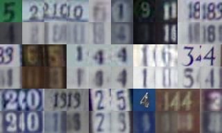
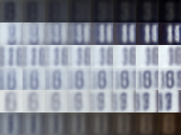
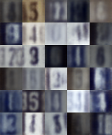
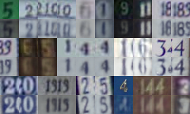
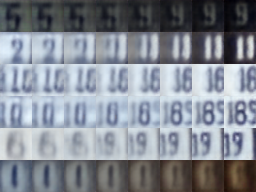
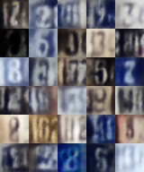

# SVHN generative modeling: VAE vs. WAE-MMD

This project implements and compares two generative models — **Variational Autoencoders (VAE)** and **Wasserstein Autoencoders with Maximum Mean Discrepancy (WAE-MMD)** on the SVHN dataset. It aims to demonstrate an academic and practical understanding of representation learning, generative modeling, and structured evaluation.

---

## Project structure

```
SVHN_WAE_VAE/
│
├── models/               # VAE and WAE-MMD architectures
├── train/                # Training scripts for both models
├── utils/                # Evaluation and visualization tools
├── results/              # Image outputs (reconstructions, samples, etc.)
├── checkpoints/          # Saved models
├── data/                 # SVHN dataset
├── main.py
├── README.md
└── requirements.txt
```

---

## How to run

### 1. Install dependencies
```bash
pip install -r requirements.txt
```

### 2. Train & evaluate the models
```bash
# train & evaluate VAE
python main.py --model vae --train --evaluate

# train & evaluate WAE-MMD
python main.py --model wae --train --evaluate
```

---

## Model overview

| Model     | Latent dim | Loss components                | Latent regularization   |
|-----------|------------|--------------------------------|--------------------------|
| VAE       | 32         | MSE + KL Divergence            | Isotropic Gaussian prior |
| WAE-MMD   | 32         | MSE + MMD (RBF kernel)         | MMD with RBF kernel      |

Both architectures are built using convolutional encoders and decoders to suit the 32x32 SVHN image domain.

---

## Evaluation metrics

| Metric      | Description                              |
|-------------|------------------------------------------|
| **FID**     | Fréchet Inception Distance (lower = better) |
| **Sharpness** | Edge variance via Laplace filter (higher = better)     |

Visual inspection is supported with:
- Image reconstructions
- Latent space interpolations
- Random samples generation

---

## Example outputs

<table> <tr> <th></th> <th>Reconstructions</th> <th>Interpolations</th> <th>Random samples</th> </tr> <tr> <td align="center"><strong>VAE</strong></td> <td align="center"></td> <td align="center"></td> <td align="center"></td> </tr> <tr> <td align="center"><strong>WAE-MMD</strong></td> <td align="center"></td> <td align="center"></td> <td align="center"></td> </tr> </table>

---

## Results

| Model     | FID   | Sharpness  |
|-----------|--------|--------------|
| VAE       | 75.926  | 0.028        |
| WAE-MMD   | 28.694   | 0.025        |


---

## Reference

- Tolstikhin et al., *Wasserstein Auto-Encoders*, 2017 — [arXiv:1711.01558](https://arxiv.org/abs/1711.01558)
